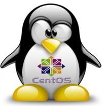

<link href="css/style.css" rel="stylesheet"/>
<link href="css/linux-history.css" rel="stylesheet"/>
<link href="css/domarrow.css" rel="stylesheet"/>

# Une histoire de l'informatique

## GNU/Linux, l'épopée d'une reconquête révolutionnaire

<!-- .slide: class="big-slide" -->

  

  <quote>
    Le manuel disait
    « Nécessite Windows XP ou mieux. »
    J’ai donc installé Linux.
  </quote>
  

  

    
  

 

Thibault Ayanides

---

<video width="1920" height="1080" controls="controls">
<source src="./video/suse_linus_said.mp4" type="video/mp4">
</video>
---

## GNU / Linux

<!-- .slide: class="big-slide" -->

  

    
    <ul>
      <li> <b>Liberté</b> parce que l'utilisateur est libre de faire ce qu'il veut avec le programme. </li>
      <li> <b>Égalité</b> parce que tous les utilisateurs disposent des mêmes libertés. </li>
      <li> <b>Fraternité</b> parce que chaque utilisateur a la possibilité de partager le programme avec le monde. </li>
    </ul>
    <em> Richard Stallman, créateur du projet GNU </em>
  

  

    
    <ul>
      <li> « Vraiment, je ne suis pas là pour détruire Microsoft. Ça sera juste un effet secondaire tout à fait involontaire. » </li>
      <li> « Software is like sex: it's better when it's free. » </li>
    </ul>
    <em>Linus Torvalds, créateur de Linux</em>
  

---

## Qu'est ce qu'un logiciel libre ?

---

## Exemples

<!-- .slide: class="big-slide" -->

  

     <!-- .element: class="fragment" data-fragment-index="2" -->
     <!-- .element: class="fragment" data-fragment-index="2" -->
     <!-- .element: class="fragment" data-fragment-index="5" -->
     <!-- .element: class="fragment" data-fragment-index="5" -->
     <!-- .element: class="fragment" data-fragment-index="5" -->
  

  

     <!-- .element: class="fragment" data-fragment-index="3" -->
     <!-- .element: class="fragment" data-fragment-index="3" -->
     <!-- .element: class="fragment" data-fragment-index="3" -->
     <!-- .element: class="fragment" data-fragment-index="7" -->
     <!-- .element: class="fragment" data-fragment-index="6" -->
  

    

     <!-- .element: class="fragment" data-fragment-index="3" -->
     <!-- .element: class="fragment" data-fragment-index="6" -->
     <!-- .element: class="fragment" data-fragment-index="7" -->
     <!-- .element: class="fragment" data-fragment-index="3" -->
     <!-- .element: class="fragment" data-fragment-index="5" -->
  

  

     <!-- .element: class="fragment" data-fragment-index="4" -->
     <!-- .element: class="fragment" data-fragment-index="2" -->
     <!-- .element: class="fragment" data-fragment-index="6" -->
     <!-- .element: class="fragment" data-fragment-index="6" -->
     <!-- .element: class="fragment" data-fragment-index="5" -->
  

  

     <!-- .element: class="fragment" data-fragment-index="3" -->
     <!-- .element: class="fragment" data-fragment-index="7" -->
     <!-- .element: class="fragment" data-fragment-index="3" -->
     <!-- .element: class="fragment" data-fragment-index="6" -->
     <!-- .element: class="fragment" data-fragment-index="3" -->
     <!-- .element: class="fragment" data-fragment-index="6" -->
  

  

     <!-- .element: class="fragment" data-fragment-index="2" -->
     <!-- .element: class="fragment" data-fragment-index="6" -->
     <!-- .element: class="fragment" data-fragment-index="2" -->
     <!-- .element: class="fragment" data-fragment-index="1" -->
     <!-- .element: class="fragment" data-fragment-index="4" -->
  

  

     <!-- .element: class="fragment" data-fragment-index="1" -->
     <!-- .element: class="fragment" data-fragment-index="3" -->
     <!-- .element: class="fragment" data-fragment-index="3" -->
     <!-- .element: class="fragment" data-fragment-index="1" -->
     <!-- .element: class="fragment" data-fragment-index="6" -->
  

  

     <!-- .element: class="fragment" data-fragment-index="4" -->
     <!-- .element: class="fragment" data-fragment-index="3" -->
     <!-- .element: class="fragment" data-fragment-index="3" -->
     <!-- .element: class="fragment" data-fragment-index="4" -->
     <!-- .element: class="fragment" data-fragment-index="5" -->
  

  

     <!-- .element: class="fragment" data-fragment-index="1" -->
     <!-- .element: class="fragment" data-fragment-index="5" -->
     <!-- .element: class="fragment" data-fragment-index="5" -->
     <!-- .element: class="fragment" data-fragment-index="4" -->
     <!-- .element: class="fragment" data-fragment-index="1" -->
  

---

## Sommaire

1. Introduction : quelques notions d’informatique
2. D’Unix à GNU/Linux : la naissance du libre
3. L’alliance entre GNU et Linux et l’essor des logiciels libres
4. Windows ou le côté obscur de la force

---

## Introduction : architecture des ordinateurs

  

    
  

  

    
  

    

    
  

Après la guerre John von Neumann définit l’architecture des ordinateurs modernes et Grace Hopper écrit le tout premier **compilateur**.

---

## Introduction : le code source

  

    
  

  

    <svg height="200" width="500">
      <defs>
          <marker id="markerArrow" markerWidth="13" markerHeight="13" refX="2" refY="6"
                  orient="auto">
              <path d="M2,2 L2,11 L10,6 L2,2" style="fill: #000000;" />
          </marker>
      </defs>
      <line x1="0" y1="150" x2="450" y2="150" class="arrow" />
    </svg>

  

  

    
  

  

    
    <svg height="200" width="500">
      <line x1="0" y1="150" x2="450" y2="150" class="arrow" />
    </svg>

  

  

    <ul>
      <li>Goût</li>
      <li>Satisfaction</li>
      <li>Sieste</li>
      <li>Énergie</li>
      <li>Sieste</li>
    </ul>
  

  

    
  

  

    <svg height="200" width="500">
      <line x1="0" y1="150" x2="450" y2="150" class="arrow" />
    </svg>

  

  

    
  

  

    
    <svg height="200" width="500">
      <line x1="0" y1="150" x2="450" y2="150" class="arrow" />
    </svg>

  

  

    
  

---

## Introduction : le système d'exploitation

<!-- .slide: class="big-slide" -->

  

    
  

  

    <ul>
      <li>GNU/Linux</li>
      <li>Windows</li>
      <li>Mac OS X</li>
      <li>Android</li>
      <li>IOS</li>
      <li>OpenSolaris</li>
      <li>FreeBSD</li>
      <li>OpenBSD</li>
      <li>AIX</li>
      <li>HP/UX</li>
      <li>Blackberry OS</li>
    </ul>
  

---

## Au commencement était le source

- Entre 1969 et 1971, les 2 briques fondamentales de l’informatique moderne sont créés :
  - Le langage C
  - UNIX
- Les développeurs (hackers) travaillaient en collaboration et s’échangeaient leurs sources, dans le but de produire le meilleur code
- L’ingéniosité de la conception d’UNIX attire les grandes entreprises, IBM, HP, etc.

---

<!-- .slide: data-background="img/history/unix_history.png" width=50% -->

---

## L'alliance rebelle

  
  

- En 1983, le développement d'UNIX se referme.
- En 1983, un hacker décide de s’opposer au verrouillage de l’informatique : c'est Richard Stallman.
- Il crée le concept de logiciel libre.
- Il commence à écrire les composants d’un nouvel UNIX, libre et qu’il nomme GNU à travers la licence GPL.

<!-- .slide: data-background="img/history/rebellion_logo.png" -->

---

## la licence GPL

- Free software as in freedom.
- liberté d'exécuter le logiciel, pour n'importe quel usage ;
- liberté d'étudier le fonctionnement d'un programme et de l'adapter à ses besoins ;
- liberté de redistribuer des copies ;
- obligation de faire bénéficier à la communauté des versions modifiées. On appelle cela le copyleft

---

## Un nouvel espoir

- En 1991, un étudiant finlandais insatisfait des outils informatiques existants, entreprend d'écrire son propre système d'exploitation.
- Il s'appelle Linus Torvalds.
- En août 1991, il annonce sur Usenet qu'il écrit un système d'exploitation.

 
 

<quote>
<em>
« Regrettez-vous avec nostalgie le bon vieux temps de Minix-1.1, quand les hommes étaient des durs et écrivaient eux-mêmes les pilotes pour leur matériel ? Êtes-vous sans projet intéressant et avez-vous envie de mettre les mains dans le cambouis d'un OS que vous pouvez adapter à vos besoins ? (...) Ceci est un système pour les bidouilleurs par un bidouilleur. Je me suis bien amusé à le faire, et ça plaira peut-être à quelqu'un d'y jeter un coup d’œil et même de l'adapter à ses propres besoins. Il est suffisamment petit pour le comprendre, l'utiliser et le modifier, et j'attends impatiemment les commentaires que vous pourriez y apporter. »
</em>
</quote>
---

## La naissance du noyau (kernel)

- 1991 : il publie son travail sur internet
- il appelle à lui la communauté des hackers
- 1992 : il place son travail sous licence GPL
- 1994 : le produit est utilisable en production
- 1994 : les interfaces graphiques arrivent
- 1998 : des grandes entreprises annoncent qu’elles proposent un support pour Linux

---

---

## Les distributions Linux

<!-- .slide: class="big-slide" -->

---

## L'exubérance des distributions Linux

<iframe data-src="https://upload.wikimedia.org/wikipedia/commons/1/1b/Linux_Distribution_Timeline.svg" data-preload width=100% height=100%>
</iframe>
---

## Red Hat

- Créée en 1993
- Introduite en bourse en 1999
- En 2000, reçoit le titre du « système d'exploitation de l'année »
- Racheté par IBM en 2019
- Vends la distribution RHEL
- En 2001, sa distribution a été valorisée à :
  - 1 milliard de dollars,
  - 30 millions de lignes de code,
  - 8.000 hommes-années de travail

---

## Centos et Fedora

- Projets basés sur la distribution Redhat
- Fedora version communautaire
- CentOS est exactement construite avec le code source de Redhat

---

## Debian

- Association non commerciale lancée en 1993
- Contrat social passé avec la communauté du logiciel libre qui définit de grands principes auxquels les développeurs adhèrent
- 1000 bénévoles (surtout développeurs)
- Distribution gratuite

---

## Debian : l'évolution

<!-- .slide: class="big-slide" -->

---

## Debian : les versions

<!-- .slide: class="big-slide" -->

---

## Ubuntu

- Canonical est fondé par un milliardaire sud-africain
- Canonical emploi plus de 650 personnes dans 30 pays.
- CA de 89 millions de dollars en 2015 (pertes de 9,9 millions de $ en 2015)
- Ses buts :
  - Fournir gratuitement Ubuntu à tous
  - Garantir sa liberté d'utilisation et sa disponibilité pour tous,
  - Fournir le support commercial et technique
  - Faire la promotion et l'aide au développement de la communauté du logiciel libre. (membre Linux Fondation)
  - Distribution clef en main

---

## Ubuntu : les versions

<!-- .slide: class="big-slide" -->

---

## Arch Linux (et Manjaro)

- Non destiné aux serveurs
- Distribution communautaire proposant un très large panel de paquets grâce aux AUR
- Prévu pour des utilisateurs avertis qui connaissent leur système

---

## La Wikipédia

- En 1999, Richard Stallman expose l'utilité d'une encyclopédie universelle et libre, et d'une ressource d'apprentissage
- En 2001, l'encyclopédie est créée
- Développement exponentiel
  - 45 millions d'articles, 299 langues (2017)
  - 5e site le plus fréquenté d'internet (2017)
- Inspire des projets similaires :
  - Wiktionnary, Wikisource, Wikiquote, Wikiversité

---

## Google

- Créé dans un garage en 1998
- 900.000 serveurs, tous sous GNU/Linux (en 2011)
- 6,5% du trafic internet mondial (2010)
- 72.100 employés (2017)
- Publie Chrome OS et le navigateur Chrome
- Soutient les développements de Linux et de multiples logiciels libres (+ hébergement)
- Édite également des logiciels propriétaires
- CA de 80Md$, bénéfices de 19Md$ (2016)

---

## Android

- "Pile logicielle" open source, basé sur Linux, clef en main, mais n'inclut pas la partie GNU
- Échange de code entre Linux et Android
- Racheté en 2005 par Google
- Pour smartphones, tablettes tactiles, etc..
- Équipe téléviseurs, radio-réveils, montres connectées, autoradios, voitures, ...
- Inclus, propose et vends des applications propriétaires
- Incorpore Google Play, magasin en ligne de Google (achat applications, logiciels, livres, films, musique)

---

## Les environnements graphiques

  

    <ul>
      <li> Mate </li>
      <li> Gnome3 </li>
      <li> KDE Trinity </li>
      <li> KDE 5 </li>
      <li> Xfce </li>
      <li> Enlightenment </li>
      <li> Unity </li>
      <li> Cinnamon </li>
      <li> Etc. </li>
    </ul>
  

  

    
  

---

## KDE5

<!-- .slide: class="big-slide" -->

---

## Trinity

<!-- .slide: class="big-slide" -->

---

## Gnome3

<!-- .slide: class="big-slide" -->

---

## Mate

<!-- .slide: class="big-slide" -->

---

## Xfce

<!-- .slide: class="big-slide" -->

---

## Enlightnement

<!-- .slide: class="big-slide" -->

---

## LXDE

<!-- .slide: class="big-slide" -->

---

## Cinammon

<!-- .slide: class="big-slide" -->

---

## Et pour ceux qui préfèrent quand même les interfaces tout moches

<!-- .slide: class="big-slide" -->

---

## Linux everywhere

<!-- .slide: class="linux-everywhere" -->

---

## Linux everywhere

<!-- .slide: class="linux-everywhere" -->

---

## Linux everywhere

<!-- .slide: class="linux-everywhere" -->

### Un exemple : le studio WETA en Nouvelle Zélande

  

    <b>Studio de postproduction s'occupant de la conception d'effets spéciaux</b>
    <ul>
      <li> Data center de 3000 m², </li>
      <li> 34 baies refroidis par water-cooling à une température de 25°, </li>
      <li> Architecture de 4000 serveurs HP Blades, </li>
      <li> 35 000 cœurs,</li>
      <li> 104 To de RAM, </li>
      <li> Une baie de 2 Po de stockage , </li<>>
      <li> Un réseau à 10Go/s. </li>
    </ul>
  

  

    
  

---

## Linux everywhere

<!-- .slide: class="linux-everywhere" -->

---

## Linux everywhere

<!-- .slide: class="linux-everywhere" -->

---

## Linux everywhere

<!-- .slide: class="linux-everywhere" -->

---

## Linux everywhere

<!-- .slide: class="linux-everywhere" -->

---

## Les acteurs du logiciel libre

<!-- .slide: class="big-slide" -->

| Associatifs            | Entreprises       |
| ---------------------- | ----------------- |
| Linus Torvalds         | Red Hat           |
| Debian                 | SuSe              |
| GNU                    | Intel             |
| FSF et Linux Fondation | Novell            |
| Ubuntu                 | IBM               |
| Slackware              | Texas Instruments |
| APRIL et AFUL          | Nokia             |
|                        | Samsung           |
|                        | Google            |
|                        | Canonical         |
|                        | Microsoft         |

---

## Les grandes entreprises ou institutions qui utilisent massivement GNU/Linux

<!-- .slide: class="big-slide" -->

---

## L'économie du logiciel libre

- Pour le noyau Linux :
  - plus de 8000 développeurs
  - 800 sociétés différentes
  - 75 % du développement Linux est effectué par des développeurs payés par leur entreprise
- Pour les logiciels libres
  - fondé sur le service, le support, la vente de licences ou de fonctionnalités supplémentaires
  - utilise parfois le financement participatif (dons, crowfunding, ...)

---

## Les gros logiciels libres

<!-- .slide: class="big-slide" -->

  

    
    
    
  

  

    
    
    
  

  

    
    
    
  

---

## Les serveurs Linux

  

    <ul>
      <li> 92 % des machines instanciées sur le Cloud Amazon (AWS) sont des serveurs Linux (2015) </li>
      <li> Plus de 50 % du cloud Microsoft (Azure) tourne sur Linux </li>
      <li> En données relatives : </li>
      <ul>
        <li> 68 % de serveurs sous UNIX, GNU/Linux ou BSD (dont environ 40% sous GNU/Linux) </li>
        <li> 32 % de serveurs Windows. </li>
      </ul>
    </ul>
  

  

    
  

---

## Les superordinateurs (2019)

| Rang | Rmax (Pflops\*) |    Nom     | Fabricant  |  Nb cœurs  |   Pays    | O.S.  |
| :--: | :-------------: | :--------: | :--------: | :--------: | :-------: | :---: |
|  1   |      148.6      |   Summit   |    IBM     | 2,414,592  |    USA    | Linux |
|  2   |      96.6       |   Sierra   | IBM/Nvidia | 1,572,480  |    USA    | Linux |
|  3   |       93        | TaihuLight |    NRPC    | 10,649,600 |   Chine   | Linux |
|  4   |       61        | Thianhe-2  |    NUDT    | 4,981,760  |   Chine   | Linux |
|  5   |       21        |  Fronteri  |    Dell    |  448,448   |    USA    | Linux |
|  6   |       20        | Piz Daint  |    Cray    |  387,872   |  Suisse   | Linux |
|  7   |       20        |  Trinity   |    Cray    |  979,072   |   Japon   | Linux |
|  8   |       19        |    ABCI    |  Fujitsu   |   391,68   |   Japon   | Linux |
|  9   |      19.5       |  SuperMUC  |   Lenovo   |  305,856   | Allemagne | Linux |
|  10  |       18        |   Lassen   | IBM/Nvidia |  288,288   |    USA    | Linux |

---

## Les 500 premiers superordinateurs (novembre 2016 et novembre 2017)

<!-- .slide: class="big-slide" -->

  

    
  

  

    
  

---

## Les superordinateurs

<!-- .slide: class="big-slide" -->

---

<!-- .slide: data-background="img/history/stats-os-world.png" -->

---

<!-- .slide: data-background="img/history/stats-os-france.png" -->

---

# Mais pourquoi Linux n'a-t-il pas percé sur le desktop ?

---

## Pourquoi GNU/Linux reste minoritaire sur le desktop ?

- La réputation geek de GNU/Linux
- L'ombre de Mac OS X
- Tous les PC sont vendus avec Windows préinstallé
- La domination de longue date du marché par Microsoft

---

# Pourquoi et comment Microsoft domine-t-il le marché ?

---

  

    <a class="tooltip" href="">
      
      Ce sont des visionnaires !
    </a>
    <a class="tooltip" href="">
      
      640 ko de RAM devraient pouvoir suffire à tout un chacun (1981)
    </a>
    Bill Gates, PDG de Microsoft 1975-2000
  

  

    <a class="tooltip" href="">
      
      Bill Gates […] révolutionne sans cesse le monde depuis les années 1960.(4 février 2014)
    </a>
    <a class="tooltip" href="">
      
      Sans l’ombre d’un doute, Steve Ballmer est le pire CEO de toutes les sociétés américaines cotées en bourse aujourd’hui. (12 mai 2012)
    </a>
    <a class="tooltip" href="">
      
      Il n'y a aucune chance que l'Iphone puisse gagner la moindre part de marché significative. (2007)
    </a>
    Steve Ballmer, PDG de Microsoft 2001-2014
  

---

## Ballmer et l'Iphone

<!-- .slide: class="big-slide" -->

<iframe data-src="https://www.youtube.com/embed/qycUOENFIBs"  data-autoplay width=100% height=75%></iframe>

---

## L'écran bleu de la mort (blue screen of death)

  

    Windows XP/Visa/7
    
  

  

    Windows 8/10
    
  

---

## L'écran bleu de la mort (blue screen of death)

<!-- .slide: class="big-slide" -->

<iframe data-src="https://www.youtube.com/embed/eKy9fV_zX_o"  data-autoplay width=100% height=75%></iframe>

---

## L'interface et l'ergonomie

<h1 class="raised-white">C’est à l’utilisateur de s’adapter à Windows et non le contraire.</h1>

<!-- .slide: data-background="img/history/ergonomie.jpg" -->

---

## La vie privée et les données personnelles

- Le premier à collaborer avec PRISM depuis 2007
- Windows 10 et son CLUF (Contrat de Licence Utilisateur Final)

<!-- .slide: data-background="img/history/private_life.png" -->

---

---

## La sécurité

- Obligation d’utiliser un antivirus
- Délai de correction
- Failles vieilles comme Mathusalem
- Défaut de conception
- Introduction de nouvelles failles prétendant boucher d’autres

<!-- .slide: class="white" -->
<!-- .slide: data-background="img/history/security.png" -->

---

## Un système en retard

- La défragmentation
- Les redémarrages
- Boulimie en ressources matérielles
- Aspect multi-utilisateur défectueux

 
 

<quote>
  <em>
  Si vous ne pouvez pas le faire bien, au moins faites le paraître bien. Bill Gates
  </em>
</quote>
---

## Les mises à jour

<!-- .slide: class="big-slide" -->

  

    <ul>
      <li>Lentes et donc longues</li>
      <li>État d’avancement</li>
      <li>Insistance / forcé</li>
      <li>Inarrêtables</li>
      <li>Instables</li>
    </ul>
  

  

  

 
 

  

    
  

  

    
  

<!-- .slide: class="white" -->
<!-- .slide: data-background="img/history/update.jpg" -->

---

## Mais alors comment Microsoft est-il devenu si riche et si puissant ?

<!-- .slide: class="big-slide" -->

<!-- .slide: class="white" -->

## <!-- .slide: data-background="#000" -->

## Le côté obscur de la Force

<!-- .slide: class="big-slide" -->

<!-- .slide: class="white" -->
<!-- .slide: data-background="#000" -->

---

## Les biens immatériels

- Bien non tangible.
- Ne doit pas être confondu avec un service qui réclame du travail.
- Coût marginal quasi nul.
- Durée de vie illimitée, ne se dégrade pas.
- Comment Microsoft est devenu aussi riche ?

 
 

  

    <quote>
      <em>
      Le logiciel de divin a ceci que comme pour les petits pains de Jésus, capable il est de multiplier les copies à l'infini, à un coût proche de zéro.
       
      Maître Yoda
      </em>
    </quote>
  

  

    
  

---

## Les dates clés

- 1981 : lancement de MS-DOS
- 1990 : lancement de Windows 3.0
- 1992 : lancement de Windows 3.1
- 1992 : lancement d’Office 3.0
- 1995 : lancement de Windows 95
- 1996 : lancement d’Internet Explorer 3.0
- 2001 : lancement de Windows XP
- 2001 : lancement de la Xbox
- 2011 : rachat de Skype
- 2014 : rachat de Nokia mobile OY et rachat de Mojang AB
- 2016 : rachat de LinkedIn
- 2018 : rachat de GitHub
- 2020 : rachat de Bethesda

---

## Les logiciels fermés

  

    
  

  

    
    <svg height="200" width="800">
      <defs>
          <marker id="markerArrow2" markerWidth="13" markerHeight="13" refX="2" refY="6" orient="auto">
            <path d="M2,2 L2,11 L10,6 L2,2" style="fill: #000000;" />
          </marker>
      </defs>
      <line x1="0" y1="150" x2="750" y2="150" class="arrow2" />
    </svg>

  

  

    
  

  

    
  

  

    
    <svg height="200" width="800">
      <defs>
          <marker id="markerArrow2" markerWidth="13" markerHeight="13" refX="2" refY="6" orient="auto">
            <path d="M2,2 L2,11 L10,6 L2,2" style="fill: #000000;" />
          </marker>
      </defs>
      <line x1="0" y1="150" x2="750" y2="150" class="arrow2" />
    </svg>

  

  

    
  

---

## De l'usage du Klingon comme arme de domination mondiale.doc

- Obsolescence programmée de Word :
- Augmentation du chiffre d’affaire
- Captivité des données et donc des utilisateurs
- Taxe monopoliste
- Conversion vers un format ouvert très difficile
- Laisser pirater Word dans les années 90 dans les universités

---

## Offensive sur la matière grise

<!-- .slide: class="big-slide" -->

---

## Affaires judiciaires

- Procès Anti-trust aux États-Unis
  - Accusation de pratiques monopolistes

---

## Affaires judiciaires

- Procès européen sur la concurrence
  - Procès Anti-trust suivant celui des États-Unis

---

## Aujourd'hui

  

    
  

  

    
  

---

# Pourquoi et comment adopter les logiciels libres ?

---

## Des exemples de migrations sous GNU/Linux

En Europe, depuis 2002, beaucoup d’exemples de migration vers GNU/Linux ont lieu : dans l’éducation, dans la gendarmerie, et même à l’Assemblée !

---

## Équivalents logiciels libres/logiciels propriétaires

<!-- .slide: class="big-slide" -->

  

    
  

  

    
  

  

    
  

  

    
  

  

    
  

  

    
  

  

    
  

  

    
  

  

    
  

---

<!-- .slide: class="big-slide" -->

  

    
  

  

    
  

  

    
  

  

    
  

  

    
  

  

    
  

  

    
  

  

    
  

  

    
  

  

    
  

  

    
  

  

    
  

---
<!-- .slide: class="big-slide" -->

  

    
  

  

    
  

  

    
  

  

    
  

  

    
  

  

    
  

  

    
  

  

    
  

  

    
  

  

    
  

  

    
  

  

    
  

---

## Que faut-il retenir de tout ça ?

- Ce qu’est un logiciel libre et la différence avec un logiciel propriétaire
- La différence entre GNU et Linux
- La notion de distribution sous Linux et les principales (Redhat, Debian, Ubuntu)
- Où est utilisé Linux aujourd’hui ? (serveurs, superordinateurs, objets connectés, …)
- Comment sont financés les logiciels libres et Linux ?

---

## Pour finir ...

- Licence
  Copyleft J. Philippe, Thibault et Pierre Ayanides 2017
  Les images et documents rapportés sont la propriété de leurs ayants-droits respectifs. Le reste de cette présentation est diffusée sous licence Creative Comons BY-SA 4.0.
- La présentation est disponible sur https://github.com/thibaultserti/slides-linux et a été réalisée avec `reveal-md`

<!-- .slide: class="white" -->
<!-- .slide: data-background="#000" -->

---

  

  <b>La pilule rouge</b> GNU/Linux, le logiciel libre.
  

  

  <b>La pilule bleue</b> Windows, le logiciel propriétaire.
  

 

<quote>
  <em>
  Beaucoup d'entre eux sont tellement inconscients et dépendants du système qu'ils se battraient pour le protéger. Morpheus à Néo
  </em>
</quote>
---

## Remerciements

- Je remercie tout d'abord les créateurs d'UNIX et du C, K. Thomson, D. Ritchie, sans qui tout cela n'aurait pas été possible,
- Je remercie R. Stallman et la FSF pour son combat pour la prédominance des logiciels libres,
- Je remercie évidemment Linus Torvalds pour son acharnement sur la création du noyau Linux,
- Je remercie Mark Shuttleworth pour sa fondation Canonical et sa distribution Ubuntu créée avec ses propres moyens et dont il ne tire quasiment aucun profit,
- Je remercie également la totalité des développeurs, contributeurs, entreprises et utilisateurs Linux pour leur participation à cette grande aventure qu'est GNU/Linux...

---

## Sources

### Liens internet

<!-- .slide: class="big-slide" -->

- https://web.archive.org/web/20081115035654/
- http://www.protegetonordi.com/rub_fiches/default.html
- http://linuxfr.org/news/microsoft-en-campagne-contre-le-piratage
- http://forum.framasoft.org/viewtopic.php?t=17902
- http://mrpogson.com/2014/04/14/growth-of-debian-gnulinux
- http://www.generation-nt.com/linux-noyau-contribution-microsoft-actualite-1563751.htm
- http://branchez-vous.com/2014/06/04/etes-vous-pret-imprimer-votre-propre-robot
- http://ascendances.files.wordpress.com/2011/10/timeline_debian_1993_20111.png
- http://royal.pingdom.com/2012/04/16/linux-kernel-development-numbers
- http://en.wikipedia.org/wiki/TOP500
- http://en.wikipedia.org/wiki/History_of_Linux
- http://www.journaldunet.com/solutions/expert/51207/l-ecrasante-domination-de-linux-dans-le-cloud---vers-90--de-part-de-marche.shtml
- http://www.silicon.fr/linux-deux-fois-plus-utilise-que-windows-82907.html

---

## Sources

### Liens internet

<!-- .slide: class="big-slide" -->

- http://www.tomshardware.com/news/linux-windows-microsoft-android-ios,20220.html
- http://www.silicon.fr/dossier-linux-monde-des-affaires-81984.html
- http://www.ginjfo.com/actualites/logiciels/linux/steam-linux-spectre-du-monopole-inquiete-20140526
- http://www.netmarketshare.com
- http://www.netmarketshare.com/report.aspx'qprid=11&qpaf=&qpcustom=Linux&qpcustomb=0&qpsp=2013&qpnp=1&qptimeframe=Y
- http://linuxgizmos.com/worlds-first-emotional-robot-runs-linux
- http://mashable.com/2011/09/17/happy-20th-birthday-linux
- http://www.tecmint.com/big-companies-and-devices-running-on-gnulinux
- http://mylinuxbook.com/awesome-devices-powered-by-linux
- http://www.extremetech.com/extreme/155392-international-space-station-switches-from-windows-to-linux-for-improved-reliability
- http://arstechnica.com/gadgets/2013/01/17000-linux-powered-rifle-brings-auto-aim-to-the-real-world
- http://168hours.wordpress.com/2008/08/10/10-coolest-devices-running-linux/
- http://linuxgizmos.com/linux-based-in-vehicle-infotainment-on-the-rise/

---

## Sources

### Liens internet

<!-- .slide: class="big-slide" -->

- http://www.linuxinsider.com/story/72867.html why toyota choose freedom
- http://fr.wikipedia.org/wiki/Fichier:Linux_kernel_map.png
- http://en.wikipedia.org/wiki/Mark_Shuttleworth
- http://www.theregister.co.uk/2014/06/09/torvalds_no_mandatory_coding_education/
- http://www.commentcamarche.net/forum/affich-2275151-les-avantages-de-linux
- http://fr.wikipedia.org/wiki/Bien_immat%C3%A9riel
- http://www.tomsguide.fr/article/windows-mac-guerre,2-1083-2.html
- http://fr.wikipedia.org/wiki/Enfermement_propri%C3%A9taire
- http://blogs.mediapart.fr/blog/jean-lucien-hardy/060214/bill-gates-requin-capitaliste-plutot-que-genie-informatique
- http://fr.wikipedia.org/wiki/DR-DOS
- http://en.wikipedia.org/wiki/Linux_adoption
- https://web.archive.org/web/20081115035654/http://www.protegetonordi.com/rub_fiches/default.html

---

## Sources

### Liens internet

- http://linuxfr.org/news/microsoft-en-campagne-contre-le-piratage
- http://forum.framasoft.org/viewtopic.php?t=17902
- http://google.image
- http://linuxfr.org/news/faites-une-bonne-action-contactez-vos-elus-territoriaux
- http://www.cours-ordinateur.fr/ballmer-demission/
- http://fr.slideshare.net/jtouzi/comparatif-windowslinux

---

### Livres

- Il était une fois Linux... de Linus Torvalds
- Le Hold Up planétaire : la face cachée de Microsoft de Roberto Di Cosmo
- Piège dans le Cyberespace de Roberto Di Cosmo
- La Cathédrale et le bazar de Éric Raymond

---

# Questions ?
