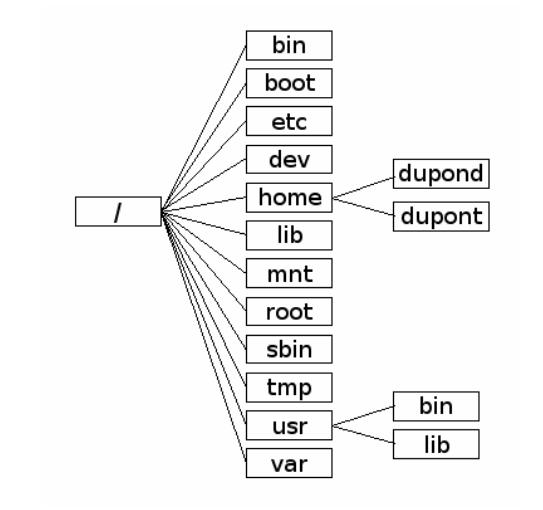

<style type="text/css">
  .reveal p {
    text-align: left;
  }
  .reveal ul {
    display: block;
  }
  .reveal ol {
    display: block;
  }
</style>

# Linux débutant

<br/>
<br/>
<br/>

Thibault Ayanides

---

## Shell, terminal, console


<!-- .element: style="width: 30%;" -->

- Shell
  - `bash`, `csh`, `zsh`, `ksh`, `sh`
- Terminal
  - `gnome-terminal`, `mate-terminal`, `terminator`, `xterm`, `konsole`
- Console
  - `tty1`, `tty2`, ... (CTRL+ATL+F1, CTRL+ATL+F2)

---

## L'arborescence des fichiers


<!-- .element: style="text-align: center;" -->

---

## Chemins relatifs, chemins absolus


<!-- .element: style="float: left; width: 50%;" -->

Si vous êtes dans `home`

- Chemin absolu `/home/dupond`
- Chemin relatifs `dupond`

- `.` répertoire où l'on est
- `..` répertoire parent
<!-- .element: style="float: right; width: 50%;" -->

---

## Le prompt

- <span style="color: red">utilisateur</span><span style="color: yellow">@</span><span style="color: green">nom-de-la-machine</span>:<span style="color: lightblue">~</span><span style="color: purple">$</span>
- `~` signifie `/home/utilisateur`
- `$` signifie que l'utilisateur a des droits restreints

---

## Quelques commandes pour commencer ...

```console [1-2|3-4|5|6-7]
$ pwd
/home/tibo/tmp
$ ls
test1 test2 toto/
$ cd toto/
$ pwd
/home/tibo/tmp/toto
```

- `pwd` permet d'afficher le répertoire courant
- `ls` permet de lister les fichiers et les répertoires d'un dossier
- `cd` permet de changer de répertoire

---

## Options courtes, options longues

```console [1-4|5-14|15-21]
$ ls -a # option courte
.  .. image.jpg test1  test2
$ ls --all # option longue
.  .. image.jpg test1  test2
$ ls -l # option courte
total 712
-rw-r--r-- 1 tibo tibo 712178 oct.  14  2019 image.jpg
-rw-r--r-- 1 tibo tibo      0 mars  19 14:16 test1
-rw-r--r-- 1 tibo tibo      0 mars  19 14:16 test2
$ ls --list # option longue
total 712
-rw-r--r-- 1 tibo tibo 712178 oct.  14  2019 image.jpg
-rw-r--r-- 1 tibo tibo      0 mars  19 14:16 test1
-rw-r--r-- 1 tibo tibo      0 mars  19 14:16 test2
$ ls -lha # combiner plusieurs options
total 712K
drwxr-xr-x 2 tibo tibo 4,0K mars  19 14:20 .
drwxr-xr-x 9 tibo tibo  12K mars  19 14:14 ..
-rw-r--r-- 1 tibo tibo 696K oct.  14  2019 image.jpg
-rw-r--r-- 1 tibo tibo    0 mars  19 14:16 test1
-rw-r--r-- 1 tibo tibo    0 mars  19 14:16 test2
```

---

## `ls -l`

<span style="color:grey">-</span>
<span style="color:fuchsia">w</span>
<span style="color:purple">r</span>
<span style="color:blue">r</span>
<span style="color:green">1</span>
<span style="color:yellow">tibo</span>
<span style="color:orange">tibo</span>
<span style="color:red">807</span>
<span style="color:olive">Jul 4 10:45</span>
<span style="color:aqua">.bash_history</span>

* <span style="color:grey">- pour un fichier, d pour un dossier, l pour un lien </span>
* <span style="color:fuchsia">droits de l'utilisateur</span>
* <span style="color:purple">droits du groupe</span>
* <span style="color:blue">droits des autres</span>
* <span style="color:green">nombre de fichiers qui pointent vers ce fichier</span>
* <span style="color:yellow">utilisateur propriétaire</span>
* <span style="color:orange">groupe propriétaire</span>
* <span style="color:red">poids du fichier en octet</span>
* <span style="color:olive">dernière date de modification</span>
* <span style="color:aqua">nom du fichier</span>

---

## Quelques raccourcis à connaître

- `CTRL+ALT+T` : ouvrir un terminal
- `CTRL+L` : effacer l'écran
- `CTRL+C` : interrompre l'exécution de la commande en cours
- `CTRL+D` : se déloguer de l'utilisateur courant (comme `exit`)
- `CTRL+W` : effacer le dernier mot
- `TAB` : autocomplétion
- `MAJ+CTRL+C` : copier
- `MAJ+CTRL+V` : coller

---

## L'opérateur glob \*

```console
$ ls *.jpg
image.jpg
$ ls te*
test1  test2
```

---

## RTFM !

```console[1|2|3-10]
$ man ls # manuel de ls
$ man man # même man a un manuel
$ ls --help # aide concise
Usage: ls [OPTION]... [FILE]...
List information about the FILEs (the current directory by default).
Sort entries alphabetically if none of -cftuvSUX nor --sort is specified.

Mandatory arguments to long options are mandatory for short options too.
  -a, --all                  do not ignore entries starting with .
  [...]
```

---

## Gestion des fichiers (1)

- `mkdir` créé un répertoire vide
- `touch` créé un fichier vide

---

## À vous !

```console[1-3|4-6]
$ mkdir directory # création de dossier vide
$ ls
directory/
$ touch test1 # création de fichier vide
$ ls
directory/ test1
```

---

## Gestion des fichiers (2)

- `mv` déplace des fichiers
- `cp` copie des fichiers
- `rm` supprime des fichiers

---

## À vous !

```console[1-3|4-6|7-9]
$ mv test1 test2 # on déplace le fichier
$ ls
directory/ test2
$ cp test2 test1 # on copie le fichier
$ ls
directory/ test1 test2
$ rm test* # on supprime tous les test
$ ls
directory/
```

---

## Un éditeur de texte


<!-- .element: style="float: right; width: 20%;" -->


- Nano !
  Simple mais atteint vite ses limites
- Permet d'écrire dans un fichier déjà créé ou de créer un fichier et d'écrire dedans
- CTRL+O : sauvegarder les modifications
- CTRL+X : quitter

---

## Afficher des fichiers et du texte

- `cat` affiche le contenu d'un fichier
- `echo` affiche des variables et des chaines de caractères
- `grep` cherche un pattern dans un fichier

---

## À vous !

```console
$ nano test
$ # on édite le fichier test
$ cat test
orange
pomme
poire
banane
$ grep po coucou
pomme
poire
```

---

## Les groupes et les utilisateurs

- **Utilisateur** : login, mot de passe, groupe(s)
- **Groupes** : regroupe des utilisateurs

* famille, parent

---

## Les droits (1)

- `chmod (u/g/o)(+/-)(r/w/x) fichier`

* change les droits d'un fichier (ou d'un répertoire avec `-r`)
* `u/g/o` : quelle colonne changer ?
* `+/-` : ajouter ou retirer des droits
* `r/w/x` : quels droits ajouter ?

---

## Les droits (2)

- `chmod XXX fichier` change tous les droits d'un fichier d'un coup
- `X` est un chiffre entre 0 et 7
- Le premier représente l'utilisateur, le deuxième, le groupe, et le troisième les autres
  * 4 pour `r`
  * 2 pour `w`
  * 1 pour `x`

- L'option `-R` permet de changer les droits récursivement

---

## Je s'appelle Root ?


<!-- .element: style="width: 30%;" -->


- Tous les droits sur tous les fichiers
- À n'utiliser qu'en cas de nécessité
- Le `$` devient `#` pour montrer que vous avez tous les droits
- `su` permet de se connecter en tant qu'un autre utilisateur (demande le mot de passe `root`)
- `sudo commande` permet d'exécuter une commande en `root` (demande votre mot de passe)
- `sudo su` permet de passer `root` avec votre mot de passe

---

## Les pipes et les redirections

- Gérer les entrées/sorties des commandes
- Le pipe `|` permet de rediriger la sortie d'une commande dans l'entrée d'un autre commande
- L'opérateur `>` permet de rediriger la sortie d'une commande dans un fichier
- L'opérateur `>>` permet d'ajouter la sortie d'une commande à la fin d'un fichier

---

## À vous

```console
$ cd ~
$ # la sortie de la commande1 devient l'entrée de la commande2
$ ls -alR | grep Do
drwxr-xr-x  2 tibo tibo    4096 janv. 18 11:28 Documents
drwxr-xr-x  6 tibo tibo    4096 mars  18 15:14 Downloads
$ ls > log
$ # on affiche le contenu de log
$ cat log
```

---

## L'installation de logiciels

Les logiciels sont regroupés dans des **dépôts**.

On les appelle **paquets**, car ils gèrent également chacun des **dépendances**.

---

## Il était une fois apt ...

- `apt install <paquet>` installe un paquet
- `apt search <paquet>` cherche un paquet
- `apt remove <paquet>` supprime un paquet
- `apt update` met à jour le cache des paquets que l'on peut mettre à jour
- `apt upgrade` met à jour les paquets (faire `update` avant)

---

## À vous

```console
$ # nécessite les droits root
$ apt update
[...]
$ apt install cowsay
[...]
$ cowsay
[...]
$ apt remove cowsay
[...]
```

---

## Random

- Vim
- `cowsay`, `fortune`

---

# Questions ?
