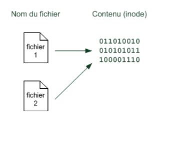
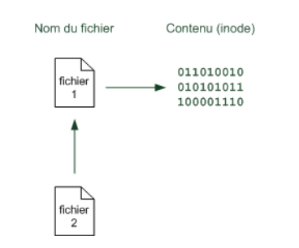
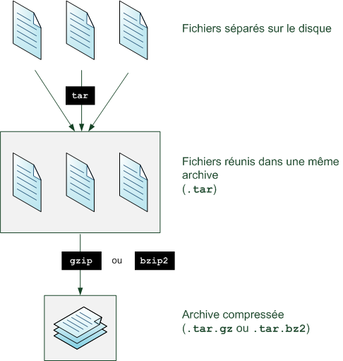

<link href="css/style.css" rel="stylesheet">

# Linux intermédiaire

 
 
 

Thibault Ayanides

---

## Prérequis

* Avoir Ubuntu ou Debian en VM ou dual boot
* Savoir se servir d'un terminal (Ctrl+L, Ctrl+C, Ctrl+D, copier-coller, autocomplétion)
* Savoir se déplacer dans son arborescence et manipuler des fichiers
(`cd`, `ls`, `cp`, `mv`, `rm`, `touch`, `mkdir`, `pwd`, `cat`, `grep`, `less` avec les options)
* Savoir chercher de l'aide (`--help`, `man`)
* Savoir rechercher, installer, supprimer et mettre à jour des paquets (`apt search`, `apt install`, `apt remove` `apt update`, `apt upgrade`)
* Savoir passer `root` (`su`, `sudo`)
* Comprendre et savoir gérer les droits (`chmod`)
* Savoir utiliser un éditeur de texte (`nano`)
* (Savoir utiliser les redirections et les pipes (`|`, `>`, `>>`))

---

## L'arboresence en détail (1)

|  Répertoire  | Signification       | Contenu                                                                                                                |
|--------------|---------------------|------------------------------------------------------------------------------------------------------------------------|
| `/`          |                     | racine du système, hiérarchie primaire                                                                                 |
| `/bin`       | binaries            | Exécutables des commandes essentielles disponibles pour tous les utilisateurs (ex: cat, ls…)                           |
| `/boot`      | bootstrap           | Fichiers statiques du chargeur d’amorçage (noyaux, images ramdisk, fichiers de configuration du chargeur d'amorçage…)  |
| `/dev`       | devices             | Fichiers spéciaux des périphériques                                                                                    |
| `/etc`       | editing text config | Fichiers de configuration au format textuel de plusieurs programmes et services du système                             |
| `/home`      | home dir            | Répertoires personnels des utilisateurs                                                                                |
| `/lib`       | libraries           | Bibliothèques partagées essentielles et modules du noyau                                                               |
| `/media`     |                     | Contient les points de montages pour les médias amovibles                                                              |
| `/mnt`       | mount               | Point de montage pour monter temporairement un système de fichiers                                                     |

---

## L'arboresence en détail (2)

|  Répertoire  | Signification         | Contenu                                                                                                                                      |
|--------------|-----------------------|----------------------------------------------------------------------------------------------------------------------------------------------|
| `/root`      | root                  | Répertoire personnel du super-utilisateur                                                                                                    |
| `/run`       | runtime system        | Informations relatives au système depuis son dernier démarrage (ex : utilisateurs actifs, services en cours d'exécution, etc.)               |
| `/sbin`      | super binaries        | Exécutables système essentiels                                                                                                               |
| `/srv`       | services              | Données pour les services du système                                                                                                         |
| `/tmp`       | temporary             | Fichiers temporaires des applications                                                                                                        |
| `/usr`       | Unix system resources | Hiérarchie secondaire, pour des données en lecture seule par les utilisateurs.                                                               |
| `/usr/bin`   |                       | Exécutables des programmes additionnels disponibles pour tous les utilisateurs (ex : le lecteur de musique, le navigateur Web…)              |
| `/usr/lib`   |                       | Bibliothèques partagées par les applications additionnelles de /usr/bin et /usr/sbin                                                         |

---

## L'arboresence en détail (2)

|  Répertoire  | Signification         | Contenu                                                                                                                                      |
|--------------|-----------------------|----------------------------------------------------------------------------------------------------------------------------------------------|
| `/usr/local` |                       | Hiérarchie tertiaire. Emplacement où les utilisateurs doivent installer les applications qu'ils compilent.                                   |
| `/usr/share` |                       | Fichiers non reliés à l'architecture partagés par les applications de /usr/bin et /usr/sbin (ex : les icônes, les thèmes, la documentation…) |
| `/var`       | variable              | Données variables et diverses                                                                                                                |
| `/opt`       | optional              | Emplacement pour des applications installées hors gestionnaire de paquets (logiciels optionnels)                                             |
| `/proc`      | processes             | Répertoire virtuel pour les informations système (états du noyau et des processus système)                                                   |

---
## Liens

 
`ln fichier1 fichier2`
<!-- .element: style="float: left; width: 30%;" -->

 
`ln -s fichier1 fichier2`
<!-- .element: style="float: right; width: 30%;" -->

---

## Vim

* `vim` nom_du_fichier
* `:q` pour quitter sans enregistrer
* `:w` pour sauvegarder
* `:x`  pour sauvegarder et quitter
* `i` pour entrer en mode insertion
* `u` pour annuler
* `Esc` pour sortir du monde insertion
* `dd` pour couper la ligne
* `yy` pour copier la ligne
* `p` pour coller
* `/termes_à_chercher` pour chercher
* `:%s/chercher/remplacer` pour chercher remplacer
* `:!` commande pour exécuter une commande bash sans quitter vim

---

## Le `.bashrc`

* Fichier de configuration du bash
* Propre à chaque utilisateur
* Contient des options de configuration du terminal ainsi que du shell
* Contient les alias et les fonctions de l’utilisateur
* Est exécuté à chaque fois que l’utilisateur se connecte

---

## Rechercher des fichiers

* `find dossier critère`
  - cherche dans le dossier dossier selon le critère critère
* `find /usr -name "*nom" -user user -exec rm -rf {} \ ;`
* `locate fichier`
  - cherche dans la db du système de fichier le fichier fichier
* `updatedb`
  - met à jour la db du système de fichier
---

## Compter, couper, trier

* `wc [-l | -w | -c] fichier`
  - Compte le nombre de lignes, de mots ou de caractères
* `cut -d ‘:‘ -f 2 fichier`
  - Coupe le deuxième champ selon le séparateur :
* `sort fichier`
  - Ordonne le fichier
* `uniq fichier`
  - Supprime les doublons de fichier

---

## Redirections erreurs et sortie standard

* `>` et `>>` : rediriger la sortie standard dans un fichier
* `2>` et `2>>` : rediriger la sortie des erreurs dans un fichier
* `2>&1` : rediriger tout dans un fichier
* `<` : lire depuis un fichier
* `<< EOF` : lire depuis le clavier jusqu’à recevoir EOF
* `/dev/null` : le trou noir

---

## Gestion des utilisateurs : ajouter et supprimer de utilisateurs et des groupes

* `adduser user` : permet d’ajouter un utilisateur user
* `addgroup  group` : permet d’ajouter un groupe group
* `deluser user` : permet de supprimer l’utilisateur user
* `delgroup group` : permet de supprimer le groupe group

---

## Gestion des utilisateurs : gérer les groupes et les utilisateurs

* `groups user` : liste les groupes de l’utilisateur user
* `passwd user` : permet de modifier le mdp de l’utilisateur user
* `usermod -aG group user` : permet d’ajouter l’utilisateur user au groupe group

---

## Gestion des utilisateurs : propriété des fichiers

* `chown user fichier` : donne la propriété de fichier à l’utilisateur user
* `chgrp group fichier` : donne la propriété de fichier au groupe group
* `chown -R user:group directory` : change l’utilisateur et le groupe propriétaire de directory et de tous ces sous-fichiers et dossiers

---

## Gestion des utilisateurs : fichiers de configuration système

* `cat /etc/passwd`
* `cat /etc/shadow`

---

## Le processus : surveiller l'activité système

* `w` : permet d’obtenir l’uptime, la charge et la liste des utilisateurs connectés
* `ps` : permet d’afficher la liste des processus
* `ps aux` : affiche la liste de tous les processus
* `pstree`  : affiche les processus sous forme d’arbre

---

## Les processus :tuer et interrompre

* `Ctrl+C` permet d’interrompre un processus (envoie le signal SIGINT)
* `kill PID` : termine le processus de PID PID (envoie le signal SIGTERM)
* `killall -9 processus` : termine le processus processus (envoie le signal SIGKILL)

---

## Les processus : htop

* Pas installé par défaut
* Permet de faire tout ce qu’on a vu avant en TUI

---

## Monter et démonter des partitions

* `mount` : voir la liste des partitions montées
* `mount /dev/sdxx mondossier/` : monte la partition `/dev/sdxx` dans mondossier
* `umount /dev/sdxx` : démonter la partition `/dev/sdxx`
* Essayer avec une clé USB

---

## Archiver

* `tar -cvf mondossier` : créé une archive
* `tar -xvf archive.tar` : extrait l’archive

---

## Compresser

Plusieurs algorithmes :
* gzip
  - `gzip archive.tar` : compresse l’archive
  - `gunzip archive.tar.gz` : décompresse l’archive
* bzip2
  - `bzip2 archive.tar` : compresse l’archive
  - `bunzip2 archive.tar.gz` : décompresse l’archive
* xz, zip, 7zip, …
  - `tar -[z|j]cvf dossier` : archive et compresse dans le même temps

---

## Systemd

* Services d’initialisation de démons
* Alternative à SysV Init
* Adopté initialement par Fedora puis par toutes les distributions majeures

---

## Gestion des services avec systemd

* `systemctl status monservice` : renvoie le statut du service service
* `systemctl start monservice` : démarre le service service
* `systemctl stop monservice` : arrête le service service
* `systemctl restart monservice` : redémarre le service service
* `systemctl enable monservice` : active le service service  au démarrage

---

## La planification des tâches

* Crontab permet d’effectuer des tâches régulièrement à des heures différées
* `crontab -e` : édite le crontab
* `crontab -l` : liste le crontab
* `crontab -r` : supprime le crontab

---

## Sticky bit, SUID, SGID

* Sticky bit : permission `t`
  - Exemple `/tmp`
  - Empêche d’autre utilisateurs que le propriétaire de renommer ou de supprimer des fichiers
* SUID : permission `s` (sur l’utilisateur)
  - sur un exécutable, permet à un utilisateur de lancer l’exécutable en tant que propriétaire du fichier
* SGID : permission `s` (sur le groupe)
  - sur un dossier, tous fichiers ou dossiers créé à l’intérieur appartiendra au propriétaire du dossier et non au créateur

---

## Scripting en bash

* Extension en `.sh`
* Exécutable soit avec
  - `bash monscript.sh`
  - `chmod u+x monscript.sh && ./monscript.sh`
* La première ligne doit être le "shebang"
  - `#!/usr/bin/env bash`
* Langage interprété mais rapide néanmoins

---

## Les variables

* NON TYPÉ
* Les variables = chaînes de caractères
* Assignation :
  - `var="/etc" && echo $var`
* On peut concaténer des chaînes facilement :
  - `var2="$var1/passwd" && echo "$var2"`

---

## Afficher et lire

* `echo chaine` : affiche une string
* `echo "$var"` : affiche une variable
* `read var1 var2` : prend l’entrée utilisateur et stocke le premier mot dans var1 et le deuxième dans var2

---

## Les variables d'environnements

* Variables utilisées par le système pour son bon fonctionnement
* `HOSTNAME`, `USER`, `HOME`, `PWD`, `PATH`, `$$`, `$?`
* On peut exporter une variable classique dans l’environnement
  - `export var`

---

## Substitution de commandes

* On peut récupérer le résultat d’une commande dans une variable
* `variable="$(commande)"`

---

## Les conditions

* `if [[ condition ]] then commande else commande fi`
* On peut tester l’existence du fichier, son type de fichier, son nom, … (`-e`, `-f`, … )
* On peut comparer des nombres (`-eq`, `-ne`, `-gt`, `-lt`, … )
* On peut tester des chaînes ( =, !=, … )

---

## Les boucles

* `for iter in sequence; do commande done`
* `while [[ condition ]] do commande done`
* `sequence` peut être le résultat d’une commande (`$(ls -d /)`)
* `{1..10..2}` pour parcourir une suite de nombre

---

## Arguments

* `./script arg1 arg2`
* Les variables $1 à $9 contiennent les arguments (au delà utiliser ${x})
* $# contient le nombre d’arguments

---

## Faire des calculs c'est compliqué

* `expr 2 + 2`
* `let var=2+2`
* `var=$((2+2))`

---

## Exercice

Développer un script
* Dit *Bonjour utilisateur* à l’utilisateur
* Demande à l’utilisateur quel est le répertoire de création
* Prend en argument un nombre n
* Créer les fichiers `test_i` où i va de 1 à n
* Écrit le numéro dans chacun d’eux

---

## Random

* Expressions régulières
* Shellcheck
* https://www.formatux.fr
* SeLinux / Apparmor, ACL
* ROOT-ME : catégorie app-script !

---

## Ce qu'il faut retenir

* vim (les bases disons)
* les variables d’environnements
* les redirections et les pipes
* les processus
* les utilisateurs et les groupes
* systemd

Le scripting en bash est très utile, néanmoins dans un premier temps, vous pouvez laisser de côté si ça fait déjà beaucoup.

---

# Question ?

---
